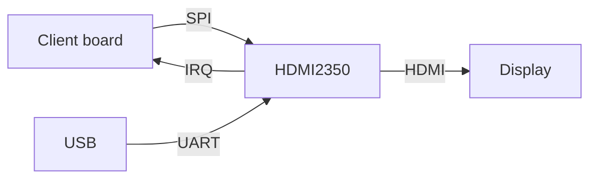

# hdmi2350

**Work in progress!**

Implementation of HDMI, targeting RP2350.
While I'm developing this with a Pico 2, 99% of this should work on any RP2350 board.

These initial versions support HDMI video (no audio yet), and render
a 848x480 framebuffer at 60 Hz.

There are a few ways to use this:
* Copy this repo, and hack it directly for your needs
* Use another RP2350 as the "video card" of your project, over SPI

# Getting started

## Dependencies

* LLVM: Clang, LLD.  Needs a new enough version which supports C++26.
* Python
* `make`
* Rust compiler
  * install via http://rustup.rs
  * add support for RP2350 ARM: `rustup target add thumbv8m.main-none-eabi`

Run `make` and copy the resulting `build/hdmi2350.bin.uf2` onto your Pico2.

# HDMI

## Mode and Timing

According to https://tomverbeure.github.io/video_timings_calculator with
848x480 @60Hz, and [CVT-RB timings](https://en.wikipedia.org/wiki/Coordinated_Video_Timings#Reduced_blanking):

* Lines: 499 total (480 active, 3 frontporch, 10 sync, 6 backporch)
* Each line: 1008 total (848 active, 48 front, 32 sync, 80 back)

The relevant section of the HDMI 1.4 spec (find a link to the PDF below)
is Section 5, "Signaling and Encoding".  This is all about the encoding of
symbols (TMDS) for pixel and control data.

A rough outline and discussion of that section and how we're using it here.

* 5.1.1. Link Architecture
  * There are three channels CH0, CH1, and CH2; plus a clock signal.
  * The three channels represent blue, green, and red (and together, the control signals).
  * RGB values of 0 to 255 are encoded as 10-bit symbols, specified earlier in DVI 1.0.
    You can find the crazy chart in the DVI PDF describing how to encode values,
    or just let the RP2350 deal with that for you.
    * Example RGB values.  Let's take the 8-bit value `60`; this encodes to `0b0111101001`,
      which has approximately as many zeroes as ones.  The on/off patterns going physically
      through the HDMI cable cause a very small (but non-zero) amount of electromagnetic activity,
      so they want DVI/HDMI transmitters to send electrically-balanced encodings of data.
      (Very hand-wavey explanation, I know.  But if you're interested
      there's much, much more info available about this.)
    * In the interest of electrically-balancing the data, we should actually be keeping
      track of the counts of ones and zeros, and if we're in a "deficit" of ones or zeros
      (i.e. imbalanced) there's an alternative way to encode the same byte of data
      with those 10 bits.  I won't go into that here, but again, see the crazy diagram in
      the DVI PDF, if you want.  (Again the RP2350 handles that for us)
  * Non-pixel data, like control signals, have specific bit patterns.
    * `CH0` has two signals to represent `HSYNC` and `VSYNC` states
    * `CH1` has patterns to represent `CTL0` and `CTL1`
    * `CH2` has patterns to represent `CTL2` and `CTL3`
    * See the timing diagram above; the HSYNC and VSYNC periods are shown,
      during which the sync signals are output on the CH0 lines.
    * Examples of CTL bits below.
* 5.2.1.1. Preamble
  * "Immediately preceding each Video Data Period or Data Island Period is the Preamble."
  * (We'll get into data islands at some other time)
  * CTL signals for a video period is `0b1000`, data island `0b1010`
  * The preamble consists of 8 identical control characters
* 5.2.1.2. Character Synchronization
  * Talks about needing to identify the locations of certain character boundaries, etc.
  * Really, this is more about how and when to frame control signals.
    * `Minimum Duration Control Period: 12 pixel-times`
  * "Extended control periods":
    * `Maximum time between Extended Control Periods: 50 ms`
    * `Minimum duration Extended Control Period: 32 pixel-times`
    * Apparently ECP's are required at least every 50ms, e.g., maybe we'll send one per frame.
      VBlank is a good time to send these long-ish (>= 32 pixel) control periods;
      since we're always sending at 60p, that's once every 16ms.
* 5.2.2. Video Data Period
  * This is when we send the pixels
  * First there's the preamble (above)
  * Then a "two character Video Leading Guard Band".  (There's no "trailing" band)
  * 5.2.2.1. Video Guard Band: specifies three 10-bit symbols for `CH0, 1, 2`.
* 5.2.3. Data Island Period
  * This is how we would send non-video (e.g., audio!) but we're not there yet.

# SPI Interface

## Commands

## Interrupts

# Limitations

## RP2350-related limitations

* Currently only supports GPIOs 0 through 29
* Not attempting backwards compatibility with RP2040 (sorry)
  - The XIP and boot2 initial setup is a pain
  - Supporting two different-enough chips is difficult
* Still only targeting ARM (Cortex-M33); no RISC-V fun yet

## HDMI-related limitations

This thing is not fully HDMI compliant, even if it does tend to work with
equipment which is HDMI licensed or certified or whatever.

* Resolution: 840x480
  - 403200 pixels, 24.2Mpx/sec @ 8-bit RGB332
  - with X/Y doubling, 420x240 (108000 pixels, 6.05Mpx/sec)
  - 1.75 aspect ratio (1.5% away from 16:9)
* No audio yet!

# TODO's

* Audio
  - ADCs should be able to support stereo 44.1KHz?
* More video modes:
  - 480x270 (1/4 of 1080p)
  - all 60 frames/sec without interlacing
* Allow improved color depth
  - currently only RGB332
* Offload drawing computation from host system:
  - Convenient and reusable display adapter with a simple interface
  - Reduces bandwidth (don't need to blast entire bitmaps at this thing)
  - Do the computations closer to the video memory

# Links

https://datasheets.raspberrypi.com/rp2350/rp2350-datasheet.pdf

## ARM
https://developer.arm.com/documentation/100235/0100/The-Cortex-M33-Processor/Exception-model/Vector-table

## Rust, including on ARMs or embedded
https://thejpster.org.uk/blog/blog-2024-08-08/
https://os.phil-opp.com/minimal-rust-kernel/
https://doc.rust-lang.org/nomicon/vec/vec-layout.html

## HDMI video mode
https://www.reddit.com/r/raspberrypipico/comments/1fj0vxg/can_you_get_169_video_with_hstx/
https://tomverbeure.github.io/video_timings_calculator

## Specs for DVI and HDMI, which somehow are publicly available
* DVI 1.0: https://www.cs.unc.edu/Research/stc/FAQs/Video/dvi_spec-V1_0.pdf
* HDMI 1.4: https://forums.parallax.com/discussion/download/128730/Hdmi-1.4-1000008562-6364143185282736974850538.pdf
