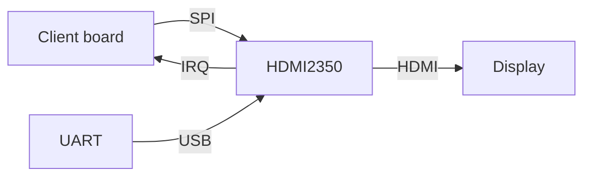

# hdmi2350

**Work in progress!**

Implementation of HDMI, targeting RP2350.
While I'm developing this with a Pico 2, 99% of this should work on any RP2350 board.

These initial versions support HDMI video (no audio yet), and render
a 400x240 framebuffer at 60 Hz.

There are a few ways to use this:
* Copy this repo, and hack it directly for your needs
* Use another RP2350 as the "video card" of your project, over SPI

# Getting started

## Dependencies

* LLVM: Clang, LLD.  Needs a new enough version which supports C++26.
* Python
* `make`
* Rust compiler
  * install via http://rustup.rs
  * add support for RP2350 ARM: `rustup target add thumbv8m.main-none-eabi`

Run `make` and copy the resulting `build/hdmi2350.bin.uf2` onto your Pico2.

# HDMI

## Mode and Timing

<!--
According to https://tomverbeure.github.io/video_timings_calculator with
800x480 @60Hz, and [CVT-RB timings](https://en.wikipedia.org/wiki/Coordinated_Video_Timings#Reduced_blanking):

-->

# SPI Interface

## Commands

## Interrupts

# Limitations

## RP2350-related limitations

* Currently only supports GPIOs 0 through 29
* Not attempting backwards compatibility with RP2040 (sorry)
  - The XIP and boot2 initial setup is a pain
  - Supporting two different-enough chips is difficult
* Still only targeting ARM (Cortex-M33); no RISC-V fun yet

## HDMI-related limitations

This thing is not fully HDMI compliant, even if it does tend to work with
equipment which is HDMI licensed or certified or whatever.

* Resolution: 400x240
  * Actual mode: 800x480 (doubled in X and Y directions)
  * Enough for e.g. an NES emulator (256x240)

# TODO's

* Audio
  * ADCs should be able to support stereo 44.1KHz?
* More video modes:
  * 480x270 (1/4 of 1080p)
  * all 60 frames/sec without interlacing
* Support for "personalities"
  * Emulate PC text modes
  * Emulate NES PPU

# Links

https://datasheets.raspberrypi.com/rp2350/rp2350-datasheet.pdf

## ARM
https://developer.arm.com/documentation/100235/0100/The-Cortex-M33-Processor/Exception-model/Vector-table

## Rust, including on ARMs or embedded
https://thejpster.org.uk/blog/blog-2024-08-08/
https://os.phil-opp.com/minimal-rust-kernel/
https://doc.rust-lang.org/nomicon/vec/vec-layout.html

## HDMI video mode
https://www.reddit.com/r/raspberrypipico/comments/1fj0vxg/can_you_get_169_video_with_hstx/
https://tomverbeure.github.io/video_timings_calculator

## Specs for DVI (which also apply to HDMI)
https://www.cs.unc.edu/Research/stc/FAQs/Video/dvi_spec-V1_0.pdf
