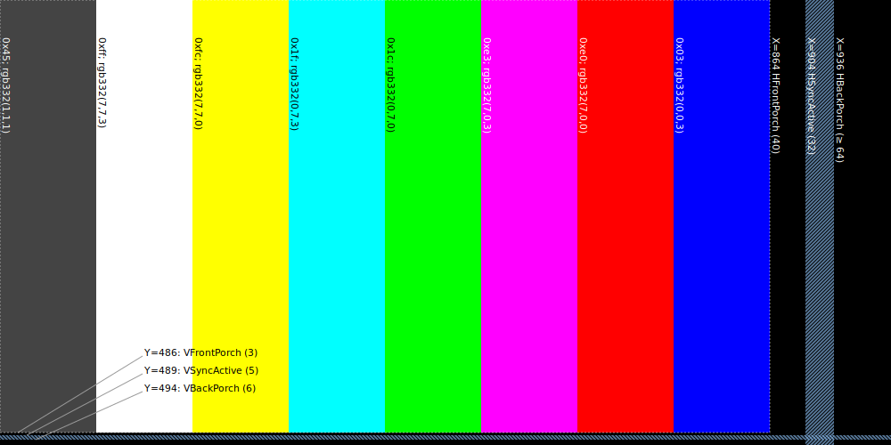

# hdmi2350

<b>(Work still in progress)</b>

Audio and video output using a Pico2.

This project aims to provide a pretty decent HDMI implementation,
with limited display capabilities, and audio.

* HDMI output device and frame buffer
  * 864 x 486 @ 60p
  * 256 colors, RGB332 format
* PCM Audio
  * Two channels
  * 44.1 kHz
* Data interface
  * Different interfaces available:
    - SPI in peripheral mode: max rate is 12.5 mbit/s
    - I2C: using "fast mode plus", 1mbit/s
    - Parallel mode (see below)
  * Raw image data
  * Text buffer
  * Draw commands

# Parallel Interface

This option exists because the full pixel rate of
$`864 \cdot 486 \cdot 60 = 25.2Mbytes/sec`$
far exceeds the rates of other interfaces (SPI, I2C).

## Signals

## Message Format

### Messages

# HDMI Generator

Until this thing is able to change resolutions on the fly,
we have this one fixed resolution of `864 x 486 @ 60p`.

This is the best resolution I could find that fit some constraints:
* Perfectly 16:9 aspect ratio
* Framebuffer of ~ 420kB fits in RP2350 main SRAM (512kB),
  using RGB332
* It's near the "target" line count of 480
  (supporting common modes like 640x480 and wider)
* Essentially the maximum amount of detail possibly in
  NTSC (standard-def) video

Further, this mode's pixel clock is near 30 MHz.
If we tweak the HBlank period to lengthen the time of each line,
we can then achieve a *range* of frames per second,
around ±1% (59 to 61 fps).

I queried
[video_timings_calculator](https://tomverbeure.github.io/video_timings_calculator)
with the parameters for `864 x 486 @ 60p`.

I found these custom HBlank values are able to achieve
varying frame rates.  Note that this calculator adjusts
the pixel clock when you change HBlank, because it keeps
the VFreq at what you requested (at 60).
I'm assuming that if we hold the clock fixed at 30 MHz,
then we can tweak the frame rate instead.

| HBlank period (pixel-times) | PixelClock MHz (@ fixed 60Hz frame rate) | VFreq (@ fixed 30.0MHz px clock) |
|--|--|--|
| 126 | 29.7 | 59.4 |
| 136 | 30.0 | 60.0 |
| 146 | 30.3 | 60.6 |

This allows us to tweak our timing very slightly
(less than 1% in practice) in case we need to match
another video source with a clock we can't control.
For example this allows for an NTSC-to-HDMI converter
generating frames at a rate almost perfectly matching the source
(say, a composite video signal from an NES).

I'm *expecting* that such fudging of line timings
won't cause instability or incompatibility with the receiver,
since this modifies HBlank (porches and HSync) only a little,
while preserving vsync and vblank line counts.

(Eventually this should allow for self-governing or PID-controlling
the output line or frame rate.  But right now we're only targeting 60.0 fps.)

## HDMI Timing

The following is the result of our calculations,
with thanks again going to `@tomverbeure` for the [video_timings_calculator](https://tomverbeure.github.io/video_timings_calculator).

|                    | fixed   | variable    | mid-range (and default)      | |
|------------------- | -------------|-----------|---|---|
| AspectRatio       | 16:9 |
| PixelClock | 30  | | | MHz |
| VActive | 486 | | | Lines |
| VBlank | 14 | | | Lines |
| VFront | 3 | | | Lines |
| VSync | 5 | | | Lines |
| VBack | 6 | | | Lines |
| VTotal | 500 | | | Lines |
| VFreq | 60 | *59.4 .. 60.6* | | Hz |
| VPeriod | 16.667 | | | ms |
| HActive | 864 | | | Pixels |
| HBlank |  | *126 .. 146* | 136 | Pixels |
| HFront | 40 |  | | Pixels |
| HSync | 32 |   | | Pixels |
| HBack |  | $`HBlank-HFront-HSync`$ | 64 | Pixels |
| HTotal |  | *990 .. 1010* | 1000 | Pixels |
| HFreq |  | *30.3 .. 29.7* | 30 | KHz |
| HPeriod |  | *33.0 .. 33.666* | 33.333| µs |

Notes:
* Assumes fixed `HBlank` to get the 60Hz frame rate at 30MHz pixel clock.
* HFront/Back/Sync ratios taken from CVT-RB column.
* Effective HBlank (sync and porches) are within the
  CVT-RB and CVT-RBv2 values, which vary a lot, so I
  assume these have decent compatibility with receivers.

# HDMI Pixel Map

The resulting `500,000` pixels (1000 wide * 500 high),
consisting of control signals, data signals, and actual video pixels,
are arranged like so.  They're transmitted top-down and left-right.

Notes:
* As mentioned above, different HBackPorch periods can be
  used to adjust actual frame rate, and this image only reflects
  the target of 60.0 Hz.

## HDMI Protocol

With that basic overview of how this resolution and its timing works, we need to talk about
the HDMI signaling lines, and operating modes.
These are described in the HDMI spec, section 5.

There are three modes: Control, Data Island, and Video Data.

I'll call "Data Island" simply "data mode",
and "video data" as "video mode".

### Link Architecture (5.1.1)

There are 4 pairs of differential lines in HDMI; one of which is the clock signal,
running at the pixel clock frequency (i.e. 30 MHz in our case).  The other 3 transmit
at 10x that rate, converting pixel/data/video to 10-bit symbols.

Across the three channels, and depending on the HDMI link's current "operating mode",
these channels each contain:
* 2 bits of control data
* 4 bits of data, where CH0 contains the packet header, and CH1-2 contain 8 bits of payload
* 8 bits of pixel values, where CH0, 1, 2 transmit blue, green, red levels respectively

### Operating Modes Overview (5.1.2)

The HDMI link is in one of these modes, and the transitions are only as illustrated above.
We can't jump between video and data; there needs to be a control period in between.

### Control (5.2.1)

Control-mode data have 6 bits, split up as 2 bits on each of the 3 channels.

[Note that the HDMI spec shows weird bit orderings;
I'm trying my best to make sure these table are all correct.]

<table border="1">
  <tr>
    <td colspan="2">Channel 2</td>
    <td colspan="2">Channel 1</td>
    <td colspan="2">Channel 0</td>
  </tr>
  <tr>
    <td>D1</td>
    <td>D0</td>
    <td>D1</td>
    <td>D0</td>
    <td>D1</td>
    <td>D0</td>
  </tr>
  <tr>
    <td>CTL3</td>
    <td>CTL2</td>
    <td>CTL1</td>
    <td>CTL0</td>
    <td>VSync</td>
    <td>HSync</td>
  </tr>
</table>

The control bits in `CTL[3..0]` may contain a preamble:
* `0001`: video preamble
* `0101`: data preamble

We'll assume bits `0000` are a no-op control code,
in which case we're sending HSync and/or VSync, or simply idle at that time.

Ignore the other 13 CTL values.  They're either not currently defined by the spec
or are used for HDCP or something else we're not concerned with.

Note that when sending a preamble, that code in CTL3..0 must be transmitted 8 consecutive times,
immediately before the data or video period.

## Control Period Coding (5.4.2)

So as we can see, we have 2 bits across each of the 3 channels.
These 2 bits are converted to one of the following 10 bit encodings
and the three channels are sending one of these codes based on their D[1..0].

| D1 | D0 | TMDS Symbol  |
| -- | -- | --           |
|  0 |  0 | `1101010100` |
|  0 |  1 | `0010101011` |
|  1 |  0 | `0101010100` |
|  1 |  1 | `1010101011` |

## Data Island Period (5.2.3)

Data islands can represent lots of different things like
color gamuts, info frames, "general" control (like `MUTE` etc).
The ones we care about however are: the Audio Sample Packet in 5.3.4,
and Audio InfoFrame in section 8.2.

Note that data islands can happen alongside HSync and VSync signals,
which requires a TERC4 symbol to be presented at CH0.
For simplicity, let's never do this, and dedicate space within VBlank,
outside of VSyncs and HSyncs.

### Island Placement and Duration (5.2.3.2)

# Links

https://datasheets.raspberrypi.com/rp2350/rp2350-datasheet.pdf

## ARM
https://developer.arm.com/documentation/100235/0100/The-Cortex-M33-Processor/Exception-model/Vector-table

## HDMI video mode
https://www.reddit.com/r/raspberrypipico/comments/1fj0vxg/can_you_get_169_video_with_hstx/
https://tomverbeure.github.io/video_timings_calculator

## Specs for DVI and HDMI, which somehow are publicly available
* DVI 1.0: https://www.cs.unc.edu/Research/stc/FAQs/Video/dvi_spec-V1_0.pdf
* HDMI 1.4: https://forums.parallax.com/discussion/download/128730/Hdmi-1.4-1000008562-6364143185282736974850538.pdf

# Misc

This project's documentation and code mention the term `hdmi`
a lot, but this is not guaranteed to be strictly HDMI compliant,
and is of course not licensed by "HDMI Licensing, LLC".
No warranties, no refunds, not for use in life-saving devices.

# License

Open source and made available under the MIT License.
