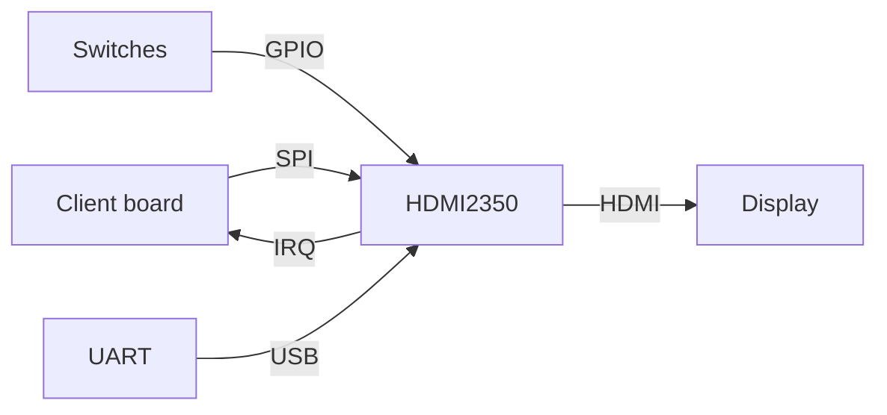

# hdmi2350

**Work in progress!**

Implementation of HDMI, targeting RP2350.
While I'm developing this with a Pico 2, 99% of this should work on any RP2350 board.

These initial versions support HDMI video (no audio yet), and render
a 432x240 framebuffer at 60 Hz.

There are a few ways to use this:
* Copy this repo, and hack it directly for your needs
* Use another RP2350 as the "VGA Card" of your project, over SPI

# Getting started

## Dependencies

* LLVM: Clang, LLD.  Needs a new enough version which supports C++26.
* Python
* `make`

Run `make` and copy the resulting `build/hdmi2350.bin.uf2` onto your Pico2.

# HDMI

## Mode and Timing

According to https://tomverbeure.github.io/video_timings_calculator with
800x480 @60Hz, and [CVT-RB timings](https://en.wikipedia.org/wiki/Coordinated_Video_Timings#Reduced_blanking):

<svg>
<title>A gradient</title>
      <linearGradient id="gradient">
        <stop class="begin" offset="0%" stop-color="red" />
        <stop class="end" offset="100%" stop-color="black" />
      </linearGradient>
      <rect x="0" y="0" width="100" height="100" style="fill:url(#gradient)" />
      <circle cx="50" cy="50" r="30" style="fill:url(#gradient)" />
</svg>

# SPI Interface

## Commands

## Interrupts

# Limitations

## RP2350-related limitations

* Currently only supports GPIOs 0 through 29
* Not attempting backwards compatibility with RP2040 (sorry)
  - The XIP and boot2 initial setup is a pain
  - Supporting two different-enough chips is difficult
* Still only targeting ARM (Cortex-M33); no RISC-V fun yet

## HDMI-related limitations

This thing is not fully HDMI compliant, even if it does tend to work with HDMI-licensed / HDMI-certified / whatever equipment.

* Resolution: 432x240
  * Actual mode: 800x480 (this uses doubling)
  * Enough for e.g. an NES emulator (256x240)
  * I would like to support more "video modes"
* No audio yet!  But two channels at 44.1kHz _should_ be feasible with RP2350's ADCs

# Links

https://datasheets.raspberrypi.com/rp2350/rp2350-datasheet.pdf

## ARM
https://developer.arm.com/documentation/100235/0100/The-Cortex-M33-Processor/Exception-model/Vector-table

## HDMI video mode
https://www.reddit.com/r/raspberrypipico/comments/1fj0vxg/can_you_get_169_video_with_hstx/
https://tomverbeure.github.io/video_timings_calculator

